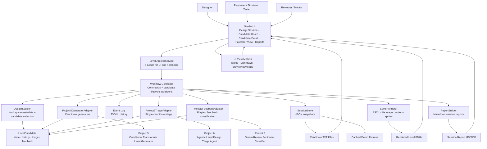
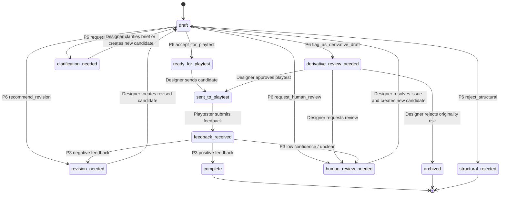
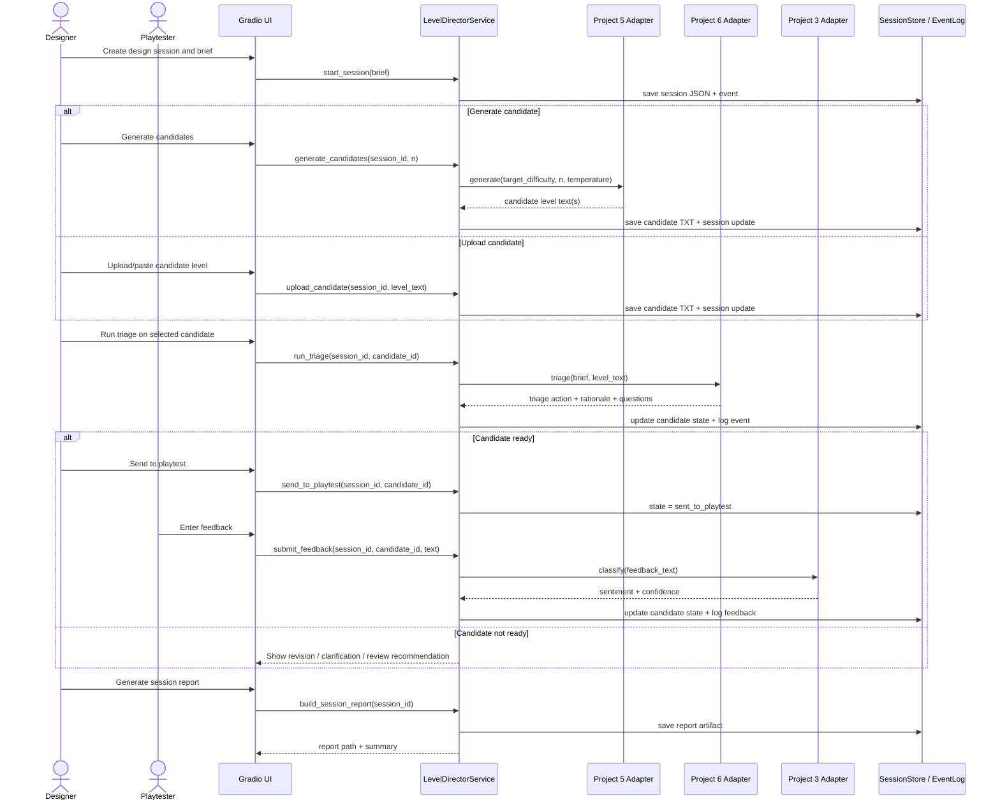
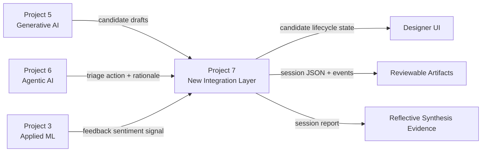

# AI Level Director Studio — System Architecture Diagram

## Main System Architecture

---

## Candidate Lifecycle State Machine

---

## End-to-End Workflow Sequence

---

## Integration Boundary Summary

---

## Architecture Notes

- Project 7 does not build a new model or new agent.
- Project 7 integrates prior capstone components through adapters.
- Project 6 remains the single-candidate triage authority.
- Project 3 is used only after playtest feedback exists.
- Project 5 provides candidate drafts, not final production-ready content.
- Candidate lifecycle state belongs to each candidate, not to the whole session.
- JSON sessions and JSONL logs provide transparency and reproducibility.
- The Gradio UI is a thin interaction layer over the backend service facade.
