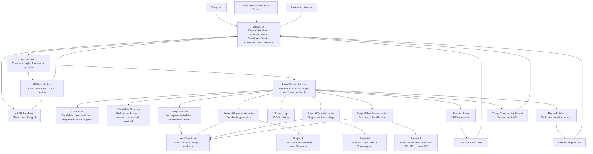

# System Architecture

The layered view of AI Level Director Studio. The Gradio UI and the reproducible
notebook both call one service facade. The facade holds the command logic, delegates
lifecycle rules to the state machine and candidate construction to the candidate
sources, and reaches each prior project only through an adapter. Persistence is local
JSON and JSONL, and each triage run also saves its full deliberation transcript and a
report for audit. The ASCII renderer is a display utility used by the UI and the view
models, not by the service.

## Layer responsibilities

- **UI (`app.py`, `ui/`):** Gradio tabs render the workspace and forward designer and
  playtester actions to framework agnostic callbacks. View models convert domain
  objects into tables and Markdown, and the ASCII renderer produces the tile grid
  previews. No UI code touches prior project internals or persistence directly.
- **Service (`workflow/service.py`):** the single backend entry point. Each command
  loads the session, performs one change, saves the session, and returns it. It owns
  no lifecycle rules itself; it delegates them.
- **State machine (`workflow/transitions.py`):** the allowed transitions plus the
  mappings from a triage action and a feedback result to a candidate state.
- **Candidate sources (`workflow/candidate_sources.py`):** builders for uploaded,
  sample, generated, and revised candidates, plus artifact saving.
- **Domain (`domain/`):** Pydantic models for the session, candidate, triage result,
  feedback result, playtest record, and candidate events.
- **Adapters (`adapters/`):** the only code that knows how each prior project loads
  and runs. They return Project 7 domain objects, so mock and real adapters are
  interchangeable behind the `Protocol` interfaces.
- **Persistence (`storage/`):** JSON session snapshots and an append only JSONL event
  log, plus a per run triage transcript and report for audit, with all output paths
  defined in one place.
