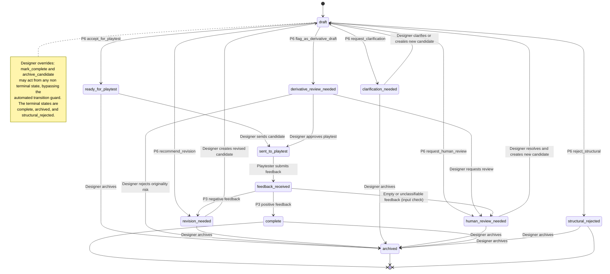

# Candidate Lifecycle State Machine

Each candidate owns its own state. Several candidates in different states coexist in
one design session. A draft candidate moves directly to one of the six triage outcome
states. Designer overrides can complete or archive a candidate outside the automated
guard. The transitions below match `ALLOWED_TRANSITIONS` in
`workflow/transitions.py`.

## Triage action to state

`run_triage` maps a Project 6 action to the resulting candidate state through
`TRIAGE_ACTION_TO_STATE`, then validates the move with `ensure_transition`.

| Project 6 action | Candidate state |
|---|---|
| `accept_for_playtest` | `ready_for_playtest` |
| `recommend_revision` | `revision_needed` |
| `request_clarification` | `clarification_needed` |
| `reject_structural` | `structural_rejected` |
| `flag_as_derivative_draft` | `derivative_review_needed` |
| `request_human_review` | `human_review_needed` |

## Feedback to state

`submit_feedback` first moves the candidate to `feedback_received`, then maps the
result. The Project 3 classifier returns a label only with no confidence score, so
the mapping is direct. Empty or blank feedback cannot be classified, so it is caught
as an input check and routed to human review rather than through the classifier.

| Feedback | Candidate state |
|---|---|
| Positive | `complete` |
| Negative | `revision_needed` |
| Empty or unclassifiable text | `human_review_needed` |

## Notes

- A revised candidate is a new candidate with `source="revised"` and a
  `parent_candidate_id`. Revisions never overwrite the original, so the iteration
  history is preserved.
- The `triaged` state exists in the `CandidateState` vocabulary but is reserved and
  unused. Triage moves a draft directly to one of the six mapped states above, so
  nothing transitions into `triaged`.
