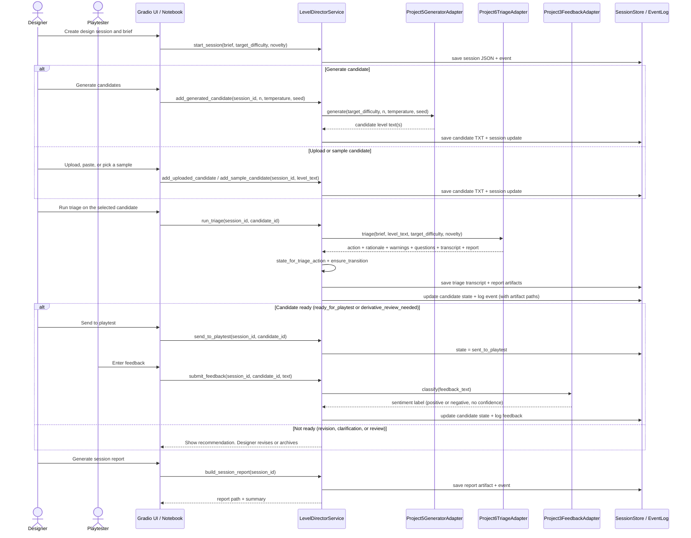

# End to End Workflow Sequence

The order of calls for a full pass through the workflow: start a session, add a
candidate, run triage, send a ready candidate to playtest, classify the feedback, and
generate a report. The participant names and method names match
`workflow/service.py`.

## Notes

- Every command persists before returning: the service saves the session snapshot and
  appends an event to the JSONL log, so the UI can recover after a restart.
- `submit_feedback` always moves the candidate to `feedback_received` first, then to
  the mapped outcome. Empty feedback is routed to human review without calling the
  classifier.
- Triage and feedback are reached only through adapters, so the same sequence runs
  against mock adapters or the real prior projects without changing the service.
- Each triage run also persists the agent's full deliberation transcript and a designer
  facing report as their own files, and the `triaged` event records their paths. The
  event log stays a scannable audit index that links to the full reasoning behind every
  triage recommendation.
