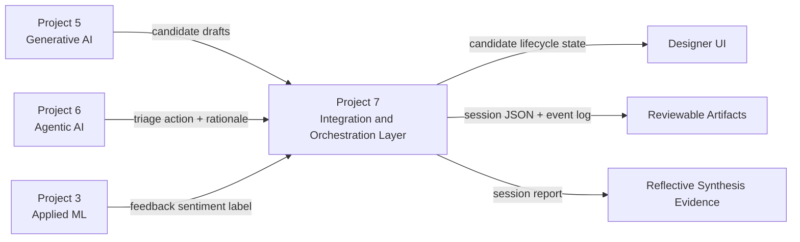

# Integration Boundaries

The high level view of the synthesis: what each prior project contributes across the
integration boundary, and what Project 7 produces from it. Each prior project is
wrapped behind an adapter and reused as built. Project 7 adds the orchestration,
candidate lifecycle, persistence, and reporting that turn three separate projects into
one reviewable workflow.

## What each project contributes

- **Project 5, Generative AI:** candidate level drafts for early iteration. The output
  is a draft to be screened, not a finished asset, and its derivative risk is
  disclosed.
- **Project 6, Agentic AI:** the design judgment layer and the single triage
  authority. It returns one of six actions with rationale, warnings, and playtest
  questions, and is reused unchanged.
- **Project 3, Applied ML:** the post playtest reception signal. It classifies
  feedback text as positive or negative, a broad signal rather than a complete
  playtest analysis, and runs only after a candidate is sent to playtest.

## What Project 7 adds

- A candidate lifecycle that holds state per candidate and routes each one based on
  triage and feedback.
- Local persistence as JSON snapshots and a JSONL event log for transparency and
  reproducibility.
- A Markdown session report and an ASCII level renderer for review.
- A service facade with a Gradio UI and a reproducible notebook over the same backend.
